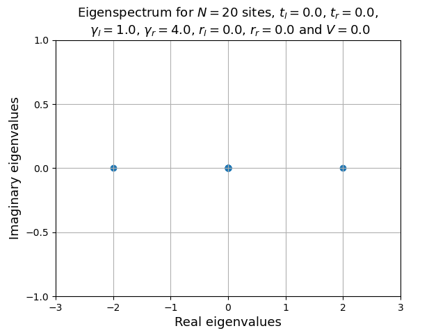
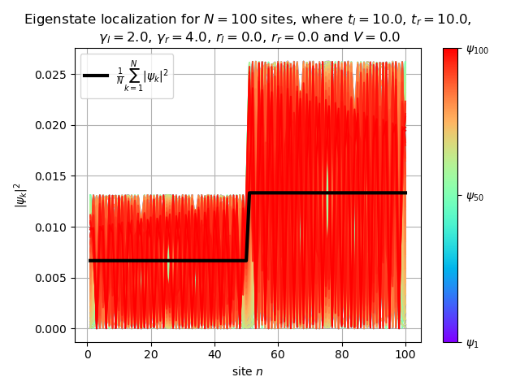

# Non-hermitian-lattice

Numerical simulation of a 1D non-Hermitian lattice with open boundary conditions, containing a central impurity.

## Project goal
Studying localization and eigenvalue behavior in a non-Hermitian system with open boundary conditions.

## Methods
- Python
- Numpy
- Numerical diagonalization
- Visualization with Matplotlib

## Results

### Eigenvalue spectrum

### Localization behavior

### Impurity density relation

## Files

analysis notebook: NHimpurity_OBC_notebook.ipynb
plots: generated numerical results

jupyter nbconvert Non_Hermitian_impurity_analysis.ipynb --to html
