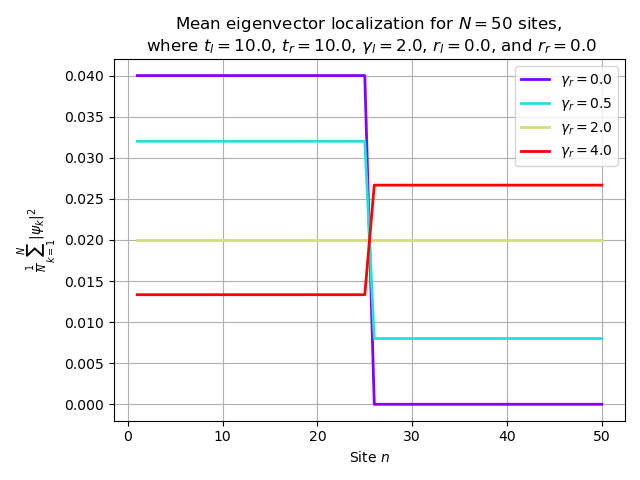

## Non-hermitian lattice - My thesis research project 

Numerical simulation of a 1D non-Hermitian lattice with open boundary conditions, containing a central impurity.

### Project goal
I studied the localization phenomena and the eigenvalue behavior in a non-Hermitian 1D system with open boundary conditions.

### Methods
- Python
- Numpy and SciPy
- Numerical diagonalization and analysis
- Visualization with Matplotlib

### Results

#### Eigenvalue spectrum

#### Localization behavior

#### Localization behavior with different number of sites

#### Impurity density relation

### Files

Plots: generated numerical results

Visit https://github.com/phSuzy/Portfolio for files such as Non_Hermitian_impurity_analysis.ipynb notebook 
